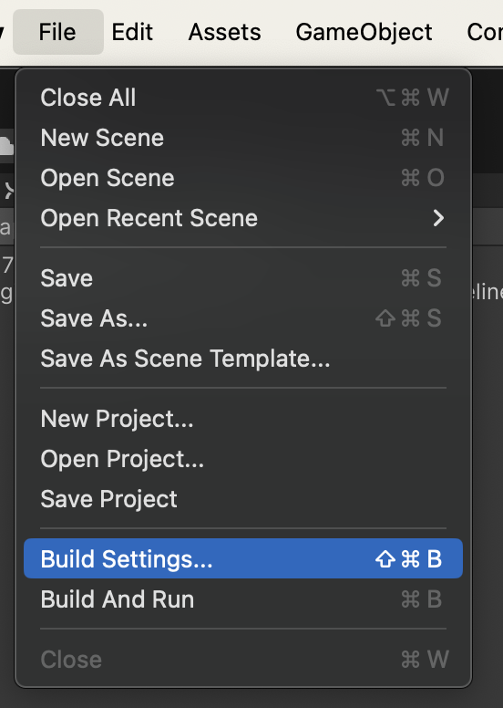
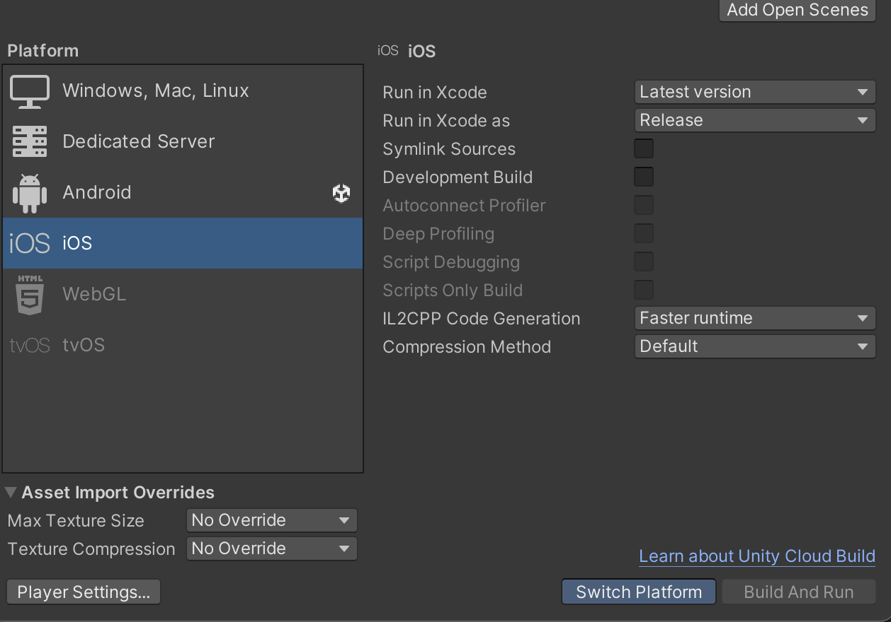
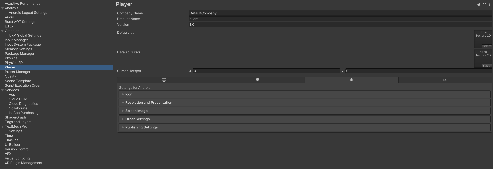

# Build Settings

We have build settings in Unity that directly affect how the game functions and renders. Follow these steps to achieve our ideal configuration.

## 1 - Open the Build Settings window:

## 2 - Ensure to copy the settings for your selected device:

Here choose your selected device (Android or IOS). Copy the following settings for each. Note that if you have the wrong device selected you have to select `switch platform` which may take a little while.

## 3 - Open the Player Settings window:

The `player settings` option can be found at the bottom left corner of the build settings window. Then, select the `Player` tab.

## 4 - Basic player settings:

Here you can find common settings shared across devices such as the name of the build (Product Name) and the icon to be shown (Default Icon). Builds with different names won't override each other, making builds from different branches to compare much easier.

## 5 - Device specific settings:

As you can see, we are provided with tabs for each device's settings:

- Windows, Mac and Linux
- Dedicated Server
- Android
- IOS

Here are the settings used by our development team:

### Windows, Mac and Linux tab

Resolution and Presentation:

- Run in Background: turn on

### Android tab

#### Resolution and Presentation

Orientation:

- Default Orientation: Landscape Left

#### Other Settings

Rendering:

- Texture compression format: ASTC

Identification:

- Minimum API Level: Android 10.0 (API level 29)

Configuration:

- Scripting backend: IL2CPP.
- Target Architectures: add ARM64.

#### Publishing settings

- Activated Custom Main Gradle Template
- Activated Custom Base Gradle Template
- Activated Custom Properties Template

### IOS tab

#### Resolution and Presentation

Orientation:

- Default Orientation: Landscape Left

#### Other Settings

Rendering:

- Texture compression format: ASTC

Configuration:

- Supported URL schemes:
  - Size: 1
  - Element 0: {REVERSED_CLIENT_ID}
    - You can find the REVERSED_CLIENT_ID in the .plist file downloaded from iOS OAuth credentials.
