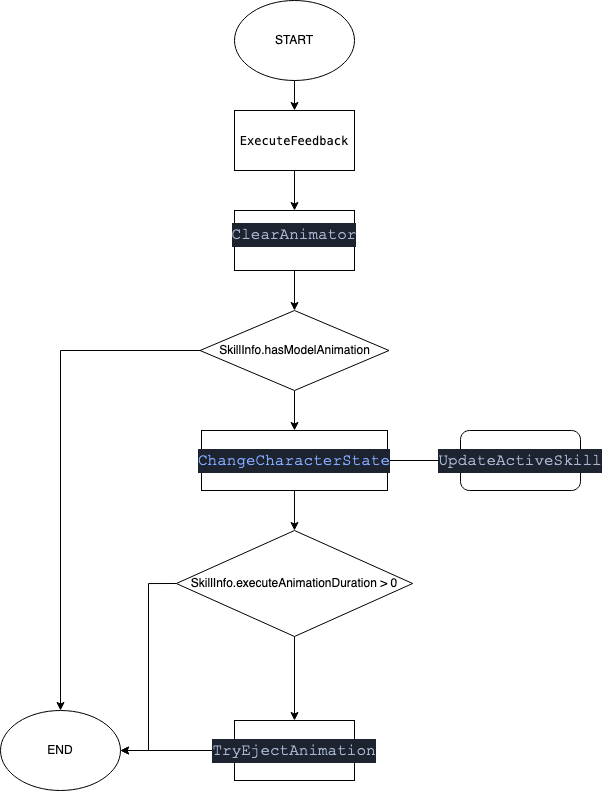
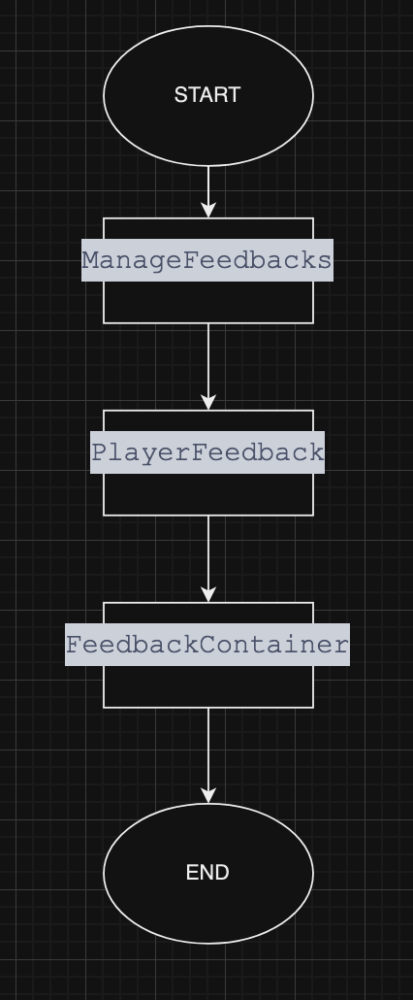

# How we handle feedbacks in the client side

#### Things to have in count before leraning how to implement new states feedback

`Feedback prefabs` 

Unity GameObject prefabs with a particle system component to show the particles effect of the state to display. You can find them in `Client/Asssets/Feedbacks/States`

`FeedbackContainer`

You can find this prefab inside each character prefab; it contains a script with the same name with a list of the Feedback Prefabs to activate. You have to set each prefab in the unity editor to the list. The methods we have here are:
- `SetActiveFeedback(string name, bool activate)` Activate or deactivate the feedback that that matches the name parameter depending on the boolean activate

- `GetFeedbackList()` Return the feedback prefabs list.

`PlayerFeedbacks`

You can find this prefab inside the `BattleManager` prefab, it serves as a connection between `Battle.cs` and `FeedbackContainer`. It implements a lot of methods for the Feedbacks, but the ones to handle the feedback states are:

- `SetActiveFeedback(GameObject player, string feedbackName, bool value)` This is in charge of connecting the `Battle.cs` and `FeedbackContainer` setting the feedback depending on the name and value.

- `ClearAllFeedbacks(GameObject player)` This method is really simple. It just clears all the active feedbacks, setting all the `setActive` of each feedback of the player to false.

`Battle.cs`

In this script is where we map the backend effects to the client effects. This script is huge! Fortunately, we only care about a couple of things here:

- `StateEffects` 
An Enum that stores the PlayerEffect states.
 Why don't we use just the `PlayerEffect` Enum instead of this `StateEffects`? Because we only care about the State effects such as Poisoned and Slowed and not the rest of the effects such as Rage, Disarm, etc.

- `playerUpdate.Effects`
This is a MapField collection with the effects from the backend. We care about the keys to compare them with our `StateEffects` Enum.

- `bool PlayerIsAlive(Player playerUpdate)` 
This method is pretty simple. Returns if the player is alive or not. We want to know it to display the effects only on alive players.

- `void ManageFeedbacks(GameObject player, Player playerUpdate)`
This method is where we combine everything we've talked about so far. Activates the feedback's effects depending on the `playerUpdates.Effects` and calls `PlayerFeedbacks>().SetActiveFeedback` to activate or deactivate the feedback. Also, it clears all active effects `if(playerUpdates.Effects.Keys.Count == 0)`
In a nutshell, this method control all the flow of the feedback states.

Check out this flowchart for a better understanding of the flow.

 
 
Simplified example

           

