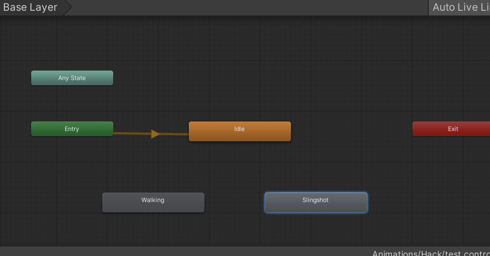
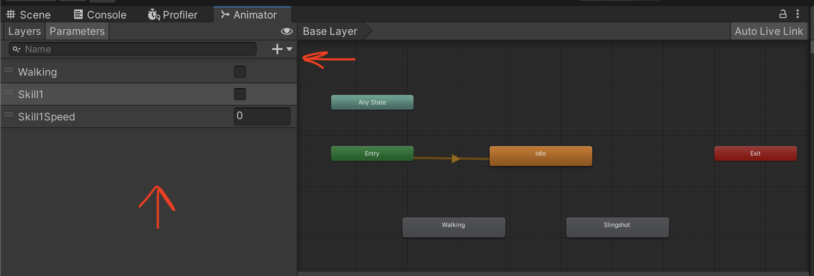

# How to Map the animations to a new character

To add the animations and adjust them to your character its simple:

First of all , if your animations are inside a model ( character model ) copy them and create a new folder for your respective character inside of `Assets/Animations` folder.

When you have all your animations in the folder, check one by one if they had the field loop time checked or not. This depends of what you want the animation to be looped or not. A good example of loop animations are Walking and Idle.

Now make sure if you have a AnimatorController for your character , if dont create one in unity top bar do:
`Assets > Create > AnimatorController` renamed and move it to the `Assets/Animations` folder.

When you have all your animations set , open the animatorController and drag the entry animation ( Idle in our case ) it will automatly connect to the entry state.

Then drag and drop in the animator the rest of the animations.Now we are ready to create the transitions 🤙.

Have in mind what we learned in the [Parameters](./animations.md) and create the respective parameters for each skill , in my case are `Walking`, `Skill1` and `Skill1Speed`.

Now create the transitions between states

Select the transition, add the parameters conditions and Tweek the transition config with what you need ( Transition duration, Has Exit Time, etc), having in count what we learned in [Transitions](./animations.md).

Also have in mind to Tweek the values of `executeAnimationDuration`,`startAnimationDuration`,`animationSpeedMultiplier` in the respective scripteableObject of the skill.

To use the `animationSpeedMultiplier` set to use the Multiplier parameter checkbox in speed section of the animation.
